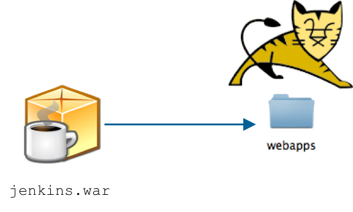
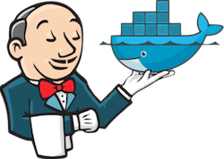
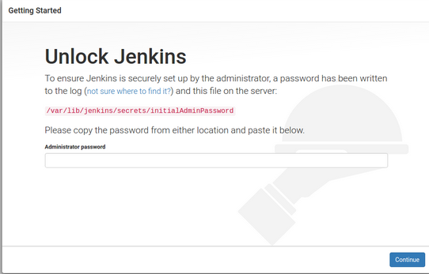
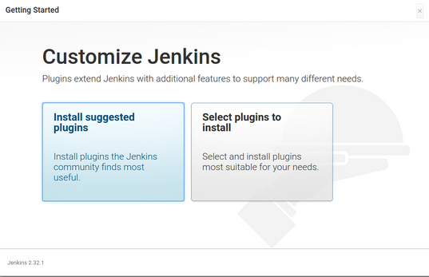
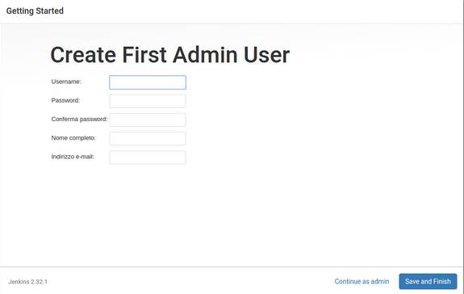
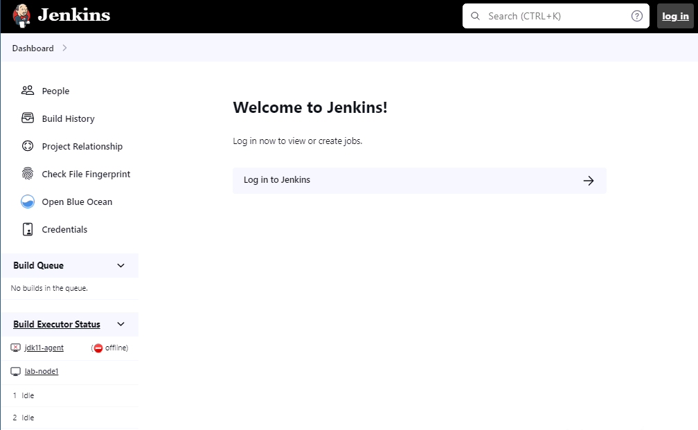
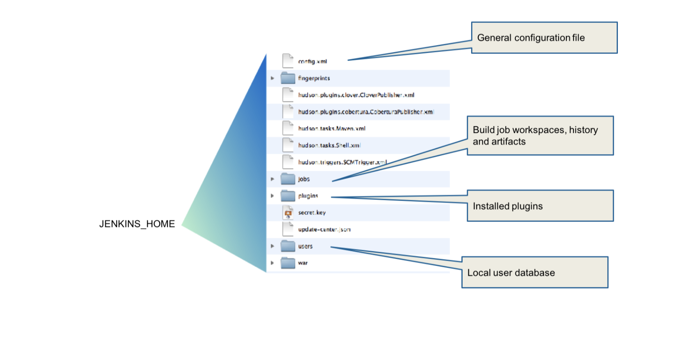

Jenkins is distributed on many channels, including:

- OS native packages (RPM, DEB, and others)
- WAR file
- Docker image
- Cloud templates (AWS, Azure, and others)

Start from the [Jenkins download page](https://www.jenkins.io/download/).

## Installing from Linux packages

Native packages are available for major Linux distributions. The major ones are:

- RPM for Red Hat family.
- Deb for Debian/Ubuntu.
- Linux Mint, OpenSUSE, and many others.

Pattern with package managers:

- Add the Jenkins Package Repository.
- Install and start Jenkins.

An example for the Red Hat family (note, these commands may need `sudo` appended for proper permissions):

```bash
# Add the Jenkins Yum Package Repository
$ wget -O /etc/yum.repos.d/jenkins.repo "http://pkg.jenkins-ci.org/redhat-stable/jenkins.repo"
$ rpm --import "http://pkg.jenkins.io/redhat-stable/jenkins.io.key"
# Install it
$ yum install jenkins
# Start it
$ service jenkins start
```
Linux Native Packages are based on the **standalone** `jenkins.war` files (with an embedded Jetty Application Server). They install Jenkins and do the following:

- Create a jenkins user.
- Set up service scripts (init.d, upstart or systemd).
- Follow native conventions for configuration files.
- Provide log rotation out of the box.

File locations are:

- Settings are located in `/etc/sysconfig/jenkins`
- `$JENKINS_HOME` defaults to the location `/var/lib/jenkins`

## Installing on Microsoft Windows

Run one of the following:

- `setup.exe`
- `jenkins.msi`, if .NET 2.0 runtime is already available

These scripts install Jenkins as a Windows service with files installed into the `%JENKINS_HOME%` folder.

The Web Application Archive (WAR) distribution of Jenkins can be run as a standalone application or in a servlet container.

## Running the Jenkins WAR as a standalone application

Run the Jenkins WAR as a standalone application from the command line. This uses an embedded application server (Jetty) and provides some extra features (restart from the web interface and others).

```bash
$ java ${JAVA_OPTS} -jar jenkins.war ${JENKINS_OPTS}
```

The following command line options are configured by startup flags (JENKINS_OPTS):

- `--prefix $PREFIX` (default: `/`)  
  Runs Jenkins to include the `$PREFIX` at the end of the URL.

- `--httpPort $PORT` (default: `8080`)  
  Jenkins listens on `$PORT` port.

- `--httpListenAddress $HTTP_HOST` (default: `0.0.0.0`)  
  Binds Jenkins to the IP address represented by `$HTTP_HOST`.

- `--logfile $LOGFILE`  
  Write to `$LOGFILE` instead of stdout.

These flags are passed as members of the JENKINS_OPTS variable, mentioned earlier.

- See [Starting and Accessing Jenkins](https://www.jenkins.io/doc/book/installing/#starting-and-accessing-jenkins) for a complete list of start-up flags that are available.
- Caveat: If you misspell an option, Jenkins ignores it rather than generating an error.

The standalone application reacts to `SIGTERM` and `SIGINT` to initiate a proper shutdown. The log file is reopened when it receives a `SIGALARM` to allow log rotation.

The following configuration example makes the Jenkins instance reachable only on [http://127.0.0.1:8081/ci](http://127.0.0.1:8081/ci).

```bash
java -jar jenkins.war --httpPort=8081 --prefix=/ci --httpListenAddress=127.0.0.1
```
For more information, see the [Starting and Accessing Jenkins](https://www.jenkins.io/doc/book/installing/initial-settings/#configuring-http/) documentation.

## Running Jenkins on an application server

You can deploy the Jenkins WAR file to an existing application server. Deploy the `jenkins.war` file in the usual manner:


  
*Figure 1. Jenkins WAR on Tomcat*

This may fit in better with existing infrastructures.

## Installing Jenkins in containers

Jenkins can be installed in either a Docker or Kubernetes container. Both container types are based on the standalone Jenkins WAR and provide:

- Weekly and Long Term Support (LTS) Jenkins versions.
- Extensible, which can be used to build your own Docker or Kubernetes Image.

## Installing Jenkins in a Docker container

The Official Docker image is on DockerHub: [https://hub.docker.com/r/jenkins/jenkins/](https://hub.docker.com/r/jenkins/jenkins/). This provides Docker infrastructure native integration.

  
*Figure 2. Jenkins on Docker*

## Installing Jenkins in a Kubernetes container

The Official Helm chart is provided at [https://github.com/jenkinsci/helm-charts](https://github.com/jenkinsci/helm-charts). Helm is the package manager used to find, share, and use software built for Kubernetes.

Jenkins X is an opinionated platform for providing CI / CD on top of Kubernetes. Find more information about the Jenkins-X project: [https://jenkins-x.io](https://jenkins-x.io).

## Post-Installation wizard

The post-installation wizard takes you through a few quick initial configuration steps that are required before you can view the Jenkins Home Page:

- Bring up a web browser and go to the `http://<myServer>:8080` URL. Replace `<myServer>` with the name or IP address of the system running Jenkins.
  
- Follow the instructions on the screen to:
  - Unlock Jenkins.
  - Install essential plugins.
  - Create the first admin user.

See [Setup Wizard](https://www.jenkins.io/doc/book/installing/setup-wizard/) for more details.

## Unlock Jenkins

Follow the instructions on the screen to access the administrative password that was set:

  
*Figure 3. Unlock Jenkins*

Note that you might need to issue the `sudo chmod 0755 name_of_dir` command to access the file that contains the initial password.

## Install essential plugins

Many of the features of Jenkins are implemented as plugins. Before opening Jenkins, you need to install a set of essential plugins that are required:

  
*Figure 4. Initial plugins*

You can install additional plugins later.

## Create first admin user

Create the first `admin` user by filling out the form on this screen, then click **Save and Finish**.

  
*Figure 5. Create first admin user*

You can create additional users after Jenkins is running.

You can now access the Jenkins Home Page, also called the Jenkins Dashboard or the Classic Web UI

 

## $JENKINS_HOME directory

`JENKINS_HOME` refers to the Jenkins home directory, located in the `/var/lib/jenkins` directory by default. This location is where all the important data for Jenkins and its build goes. By default, it can be set either as a system property or an environment variable and can be verified from the system config page.

The directory structure is shown here:

  
*Figure 7. Jenkins Home directory structure*

## What did we learn?

- Jenkins is distributed in many channels, even Docker.
- Try to use the standalone version.
- Tune your JVM and operating system and monitor performance.
- Know your Jenkins Configuration and Jenkins Home locations.

## Going further

Recommended readings on this subject:

- [Jenkins Home Page](https://www.jenkins.io/)
- [Installing and Starting Jenkins](https://www.jenkins.io/doc/book/installing/)
- Oracle, [Understanding Memory Management](https://docs.oracle.com/en/java/javase/11/gctuning/introduction-garbage-collection-tuning.html)
- [limits.conf(5) man page](http://man7.org/linux/man-pages/man5/limits.conf.5.html)
- [Docker Repository for Jenkins](https://hub.docker.com/r/jenkins/jenkins/)


